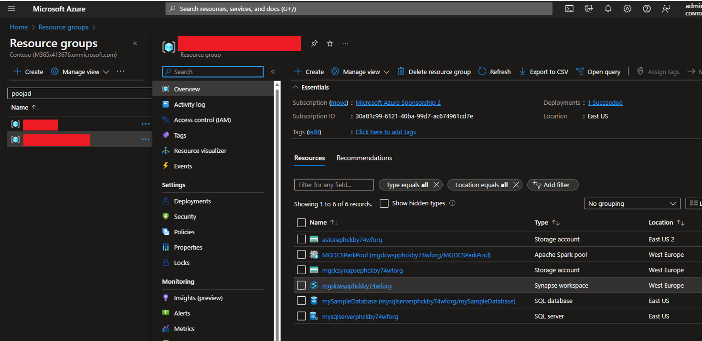
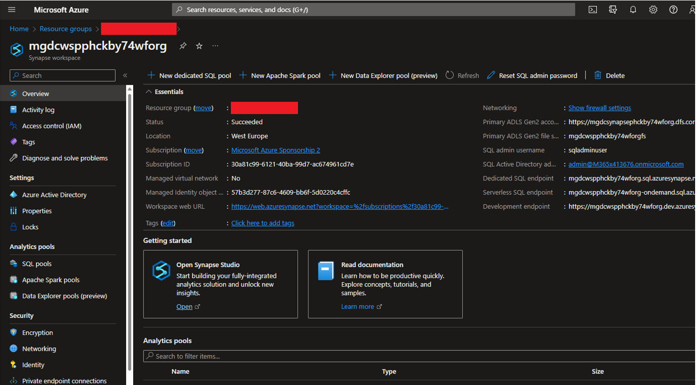
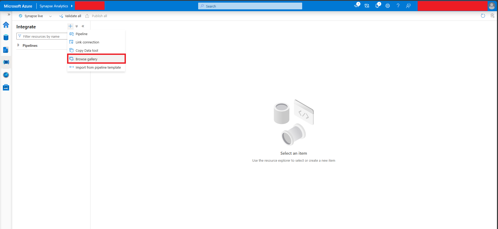
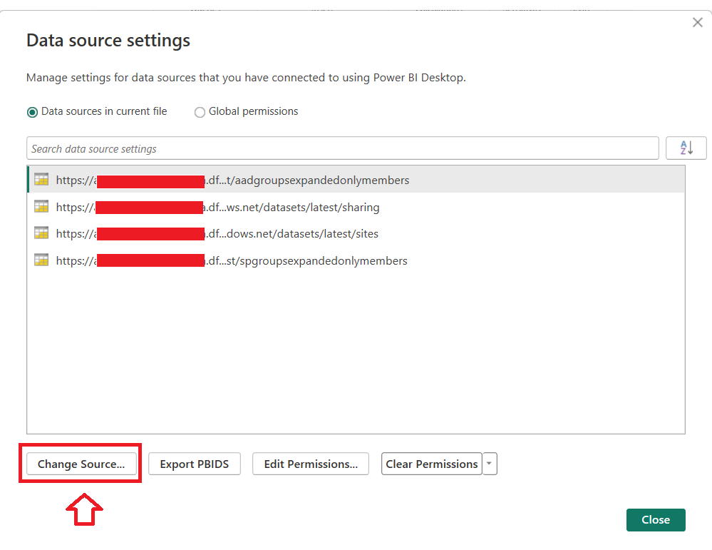
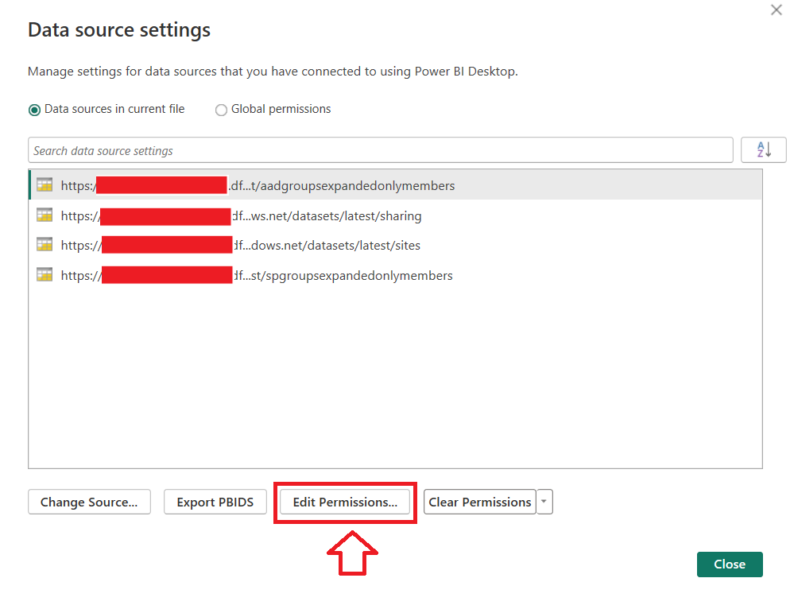

# Information oversharing template setup

- [Overview](#Overview)
- [Installing Pre-reqs](#Installing-Pre-reqs)
- [Synapse pipeline template](#Synapse-pipeline-template)
- [PBI report template](#PBI-report-template)

## Overview

Information oversharing is a security and compliance use case powered by our newly available SharePoint datasets. This allows customers to better understand how secure their SharePoint is, maintain information boundaries, and establish new rules based on how sensitive data is managed and classified.

**After you follow these steps, you will have a great set of Power BI dashboards related to SharePoint security, like the one shown below.**

 

## Installing Pre-reqs
The first step to running this template would be to create an application in the tenant and use that appId 
and secret to setup the other required resources.

1. Navigate to app registrations in your subscription.

2. Register a new application

3. Save the application id (In the screenshot, the one ending in 9826). Navigate to API permissions

4. Select "Microsoft Graph" from the Add permission flyout

5. Select "Application permissions -> Applications -> Application.Read.All"

6. Explicitly Grant consent for the new permissions

7. Verify that that the status shows as granted for the new Application.Read.All permission

8. Navigate to "Certificates and secrets" in the left pane and click on "New client secret"

9. Provide a description and add a secret

10. Copy the value of this new secret and save it securely before navigating away from this page

11. Use this link to initiate the setup of the pre-requisites. Use the appid and secret created in the 
previous steps. Custom deployment - Microsoft Azure [here](https://portal.azure.com/#create/Microsoft.Template/uri/https%3A%2F%2Fraw.githubusercontent.com%2Fmicrosoftgraph%2Fdataconnect-solutions%2Fmain%2FARMTemplates%2FMGDC%20Extraction%20Pre%20Reqs%2Fazuredeploy.json?token=AATN3TJ6UQWU7TFMZ2R6ZW3ASL5JQ)

The link above sets up the pre-requisites to using the information oversharing template, which are:

- Create a Synapse Workspace
- Create a Spark Pool for the Synapse workspace
- Create a storage account for the extracted data
- Grant permission to the Synapse workspace & the Microsoft Graph Data Connect Service Principal to the storage account as Blob Data Contributor
- Create an Azure SQL Server
- Create a sample database within the Azure SQL Server.

By clicking on the above button (or navigating to the linked URL), users will be brought to the Azure portal on the Custom deployment page.

On that screen, on top of providing information about the resource group and region to deploy the components into, they will need to provide the following information:

- Application Id to be used by Microsoft Graph Data Connect (from step #3, ending in 9826)
- Application secret for that app
- A new password for the Azure SQL Server

Once all required information has been provided, click on the Review + create button at the bottom of the page:

This will validate that the information provided to the template is correct. Once the information has been validated, click on the Create button at the bottom of the page.

This will initiate the deployment. It should normally take about 5 minutes for the whole deployment to 
complete.

## Synapse pipeline template

1.  After the pre-reqs are complete, navigate to the Synapse workspace just created

2.  Open the Synapse Studio

3.  Navigate to "Integrate -> Add new resource ->Browse gallery"

4.  Search for "SharePoint" and select the "Unlock advanced analytics and insights using Microsoft 365 SharePoint datasets" template and Continue

5.  Create the new Linked services required by this pipeline

6.  Provide the parameters of the Linked Service 
        a. Select Authentication Type = Service Principal 
        b. Use the storage account name, SPN id and secret (SPN key) from the pre-req steps above
        c. Test Connection and then click on Create

7.  Repeat the inked Service creation steps for the source linked service

8.  Select "Open Pipeline"

9.  Click on "Publish All" to validate and publish the pipeline

10. Review the changes and click Publish

11. Verify that the pipeline has been successfully published

12. Trigger the pipeline

13. Provide the required parameters. Use the Storage Account, Storage Container and Spark Pool Name created by the pre-req steps above (Note: names are case sensitive)

14. Congratulations! You just triggered your first Microsoft Graph Data Connect pipeline! Once the admin consents to the request the data will be processed and delivered to your storage account.

15. You will see the data in the storage account.

## **PBI report template**
Below steps will help to link datasets that are generated using Synapse pipeline above to link to PowerBI 
Template. 
1. Download and install Microsoft Power BI Desktop if you don’t have it installed already on your machine. 
    - Link to download Download Microsoft Power BI Desktop from Official Microsoft Download Center. [here](https://www.microsoft.com/en-us/download/details.aspx?id=58494)
2. Download the pre-created PowerBI security report that can generate insights from data that is produced using Synapse pipeline in azure storage locations. Link to download PowerBI Report. [here](https://go.microsoft.com/fwlink/?linkid=2211101)

3. Open the PowerBI file and click on Transform data → Data source settings

4. You will see 4 data sources in the Data source settings page

5. Select one of the data source settings and click on Change Source.
    - Change the Storage account path in URL with right storage account that data is generated from synapse pipeline in the steps above. You can get the storage account that is used in Synapse template pipeline Step 6 above
    - Repeat changing storage account names to all 4 Data sources in current file.

6. Now we need to give the right storage account key / credentials for these data sources.
    - Click on Edit Permissions

                

    - Click on Edit under credentials

                

    - Enter the storage account key value

                

    - If you don’t know have storage key get the storage account key by navigating to storage account in azure portal (storage account → access keys)

                 

7. Congratulations, you are all set and will see that the report will be refreshed with the latest data

     

8. If you see any error or data is not being refreshed then please make sure your entered right storage account details, path and GUID information along with credentials in data source settings
