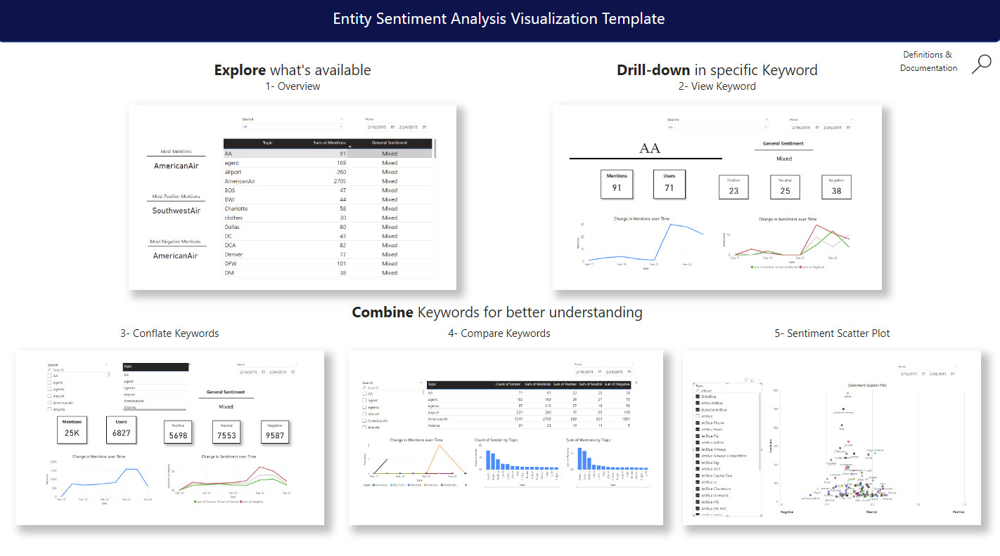
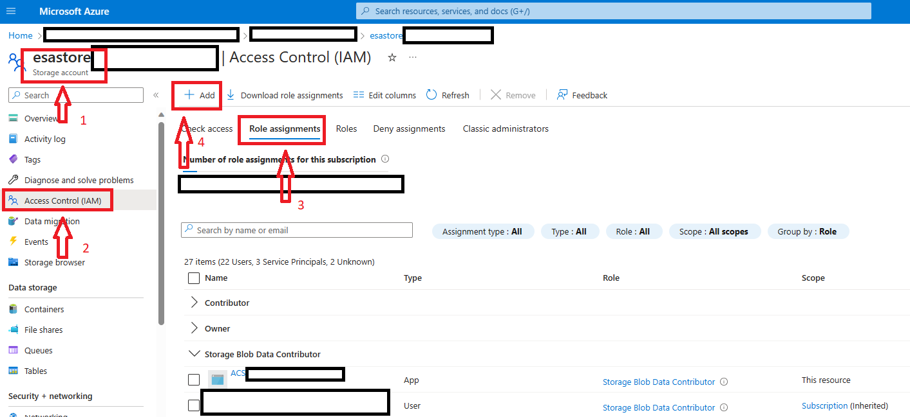

# Entity Sentiment Analysis template

- [Overview](#Overview)
- [Installing Pre-reqs](#Installing-Pre-reqs)
- [Synapse Pipeline Template](#Synapse-Pipeline-Template)
- [PBI Report Template](#PBI-Report-Template)
- [Feedback & Considerations](#Feedback-&-Considerations)

## Overview

The purpose of ESA is to track what topics people are discussing in internal communications and how they're discussing them. With this tool, you'll be able to detect potential security conflicts, monitor reception to particular events, and gather company-wide sentiment surrounding important concepts. This solution template enables customers to leverage ESA metrics from M365 data and analyze the entities and sentiments therein.

This template leverages a Contoso emails and teamschat datasets, as well as a completed Entity and Sentiment Analysis dataset based on a public Enron emails dataset.

**After you follow these steps, you will have a Power BI dashboard related to Entity Sentiment Analysis, like the one shown below.**

## Installing Pre-reqs

If you do not have an MGDC app, please proceed to the detailed documentation [here](https://github.com/microsoftgraph/dataconnect-solutions/tree/main/solutions/esa/PreRequisites)  

If you already have an MGDC app and its secret, the automated deployment to Azure helps setup the required resources in 5 minutes. 

The link below sets up the Azure resource group for the template, which are:

- Create an Azure Cognitive Services (ACS) Language Resource
- Create a Synapse Workspace
- Create a Spark Pool for the Synapse workspace
- Create a storage account for the extracted data
- Grant permission to the Synapse workspace & the MGDC Service Principal to the storage account as Storage Blob Data Contributor

Custom deployment - Microsoft Azure [here](https://portal.azure.com/#create/Microsoft.Template/uri/https%3A%2F%2Fraw.githubusercontent.com%2Fmicrosoftgraph%2Fdataconnect-solutions%2Fmain%2Fsolutions%2Fesa%2FARMTemplate%2Fazuredeploy.json)

Provide Storage Blob Data Contributor access to the user who is developing the solution. The Synapse workspace should already have access with the automated deployment. 

## Synapse Pipeline Template

1.  Download the ESA pipeline template .zip from [here](https://github.com/microsoftgraph/dataconnect-solutions/tree/main/solutions/esa/SynapsePipelineTemplate)

2.  Follow the [Synapse Pipeline Integration instructions](https://github.com/microsoftgraph/dataconnect-solutions/tree/main/solutions/esa/Synapse%20Pipeline%20Integration) to integrate the pipeline. 

3.  After completing the Pipeline Integration and running the pipeline, you will see the data in the storage account

## **PBI Report Template**

For setup instructions and usage, please refer to the documentation [here](https://github.com/microsoftgraph/dataconnect-solutions/tree/main/solutions/esa/PBItemplate) 

Download the pre-created PowerBI security report that can generate insights from data that is produced using Synapse pipeline in azure storage locations. 

Link to download PowerBI template [here](https://github.com/microsoftgraph/dataconnect-solutions/blob/main/solutions/esa/PBItemplate/ESA%20Template.pbix)

